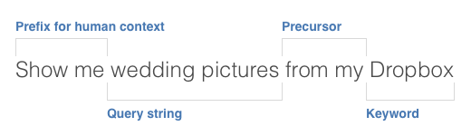

# Voice Command
##### Extensible Chrome voice command tool


### [View demo page](https://truthlabs.github.io/voice-command/)
###### (Chrome only, requires microphone permissions).

---

Voice command uses Google's [Web Speech API](https://developers.google.com/web/updates/2013/01/Voice-Driven-Web-Apps-Introduction-to-the-Web-Speech-API) to turn speech into text, then uses an easily editable list of keywords to direct the search to the correct page.  Integrating new sites with keywords is simple and takes seconds, with basically no research and very little coding knowledge.

I personally use a fork of this as my [new tab page](https://s.codepen.io/drewvosburg/debug/rOqdjj).

## Keyword objects
The code uses and array of keyword objects to search for what the user wants to do. Keyword objects are simple JSON objects with three properties: `keyword`, `url`, and an optional `suffix`.  The average keyword object looks like this: 
```javascript
{ keyword: 'Google', url: 'https://google.com/search?q=' }
```

The three components are fairly straightforward, but it's worth exploring in further detail.

#### Keyword
The `keyword` is either a string or an array of strings.  Arrays of strings can be in any order and may include spaces.

#### URL
The purpose of the `url` parameter is to provide a URL with the parameter name for a query for that specific page, which is often `?q=` at the end of a URL.  These can be easily reverse engineered from almost every website by performing a search on the target website and reducing the parameters in the resulting URL to only include the query.

#### Suffix
For some reason, some sites insist on having certain characters or parameters at the end of the URL to work properly.  For this reason, there is an optional `suffix` parameter.  If this is required, often it is a `/` or `&` character.

#### Bonus: Command
I only have used this once, but it's working around other behavior of the script.  If you say a keyword with no query string, like "Facebook," then it goes to the base URL of the URL found in that keyword object. For something like "Find my iPhone" where the base URL doesn't take you directly to the content, I had to create an exception.  This means that if you're going to a keyword with `"command":true`, it won't go to the base URL, but to the full URL.  Edge case, but it might be helpful.

## Language parsing
I wrote the string parsing myself.  Conceptually, I'm splitting the string up like so:



The two main pieces that I'm looking for are the query string (what you're searching for) and the keyword (where you're searching).

#### Query string
The brunt of the spoken phrase or sentence is likely to be the query string. This is the word or phrase that you want to find

#### Worthless prefixes
Imperative English sentences often begin with words that provide context to English speakers that the sentence is a command.  Usually this includes a verb.  I have created an array of common phrases that I have used to make commands that provide the script with no helpful information about context.  These are stripped out of the user's spoken sentence if they appear at the beginning.

These are stored in an array of strings called `worthlessPrefixes`, which can easily be modified.

#### Keyword
The keyword helps me look up the corresponding keyword object to know what URL to send the query string to.

#### Precursor
The precursor is an optional piece that serves two functions. First, it helps users switch their sentences around syntactically, getting the same results for "Google Elon Musk" as "Elon Musk on Google." Secondly, it can serve as a tiebreaker in instances where there is more than one keyword.

For example, say you wanted to see the Twitter accound for Google, but Google is a keyword. You can say "Google on Twitter," and the precursor "on" helps understand that we should be searching the next keyword, which is Twitter.  Without a precursor, I assume that the first keyword is the one we are searching, e.g. "Google Twitter."

## Keyword Packs

I built this to be extensible by "packs," which are JSON files with an object with a "keywords" array of keyword objects. The default included pack is based on the top 100 sites visited from the United States according to [Alexa rankings](http://www.alexa.com/topsites/countries/US). I excluded banks, pornographic sites, and marketing sites.

The script loops through an array called `keywordPacks`, which is an array of strings that are URLs to the JSON files for each pack. On load, AJAX calls are made and the keywords from each pack are added to the `keywords` array.

#### Supported services

I made a default set of keywords to support the top 100 sites visited from the US according to Alexa rankings. I excluded banks, marketing sites, and pornographic sites, and included additional services that I find useful. The following is a list of the 88 services available in the default pack:

- Google
- Facebook
- YouTube
- Amazon
- Yahoo
- Wikipedia
- eBay
- Twitter
- Reddit
- Netflix
- HBO Go
- Soundcloud
- JustWatch
- Evernote
- Hulu
- Twitter
- Gmail
- Google Keep
- Google Photos
- Google Drive
- Google Maps
- Hulu
- Dropbox
- Speedtest.net
- Airbnb
- Instagram
- Pandora
- Spotify
- The Noun Project
- GitHub
- Stackoverflow
- Linkedin
- Pinterest
- Craigslist
- DuckDuckGo
- Imgur
- Go.com
- Bing
- Tumblr
- ESPN
- CNN
- Diply
- New York Times
- MSN
- IMDb
- Walmart
- Apple
- Yelp
- OneDrive
- Outlook
- Etsy
- Target
- Aol
- Buzzfeed
- Home Depot
- The Washington Post
- Fox News
- Indeed.com
- TripAdvisor
- Best Buy
- Groupon
- Gfycat
- Slickdeals
- Salesforce
- Forbes
- USA Today
- Adobe
- Lowe's
- IRS.gov
- Vice
- CNet
- Twtich.tv
- Macy's
- Ask.com
- About.com
- MLB.com
- National Institutes of Health
- CBS Sports
- Business Insider
- Kohl's
- Dictionary.com
- Weather.com
- Blogspot
- Huffington Post
- Wordpress
- Realtor.com
- Zillow
- Wikia
- The Daily Mail